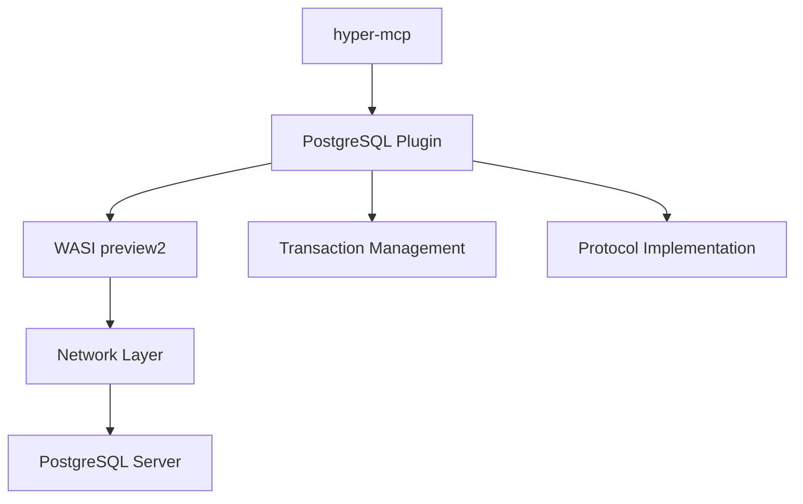
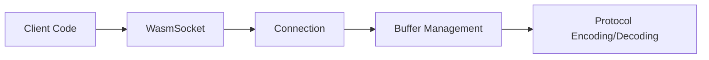
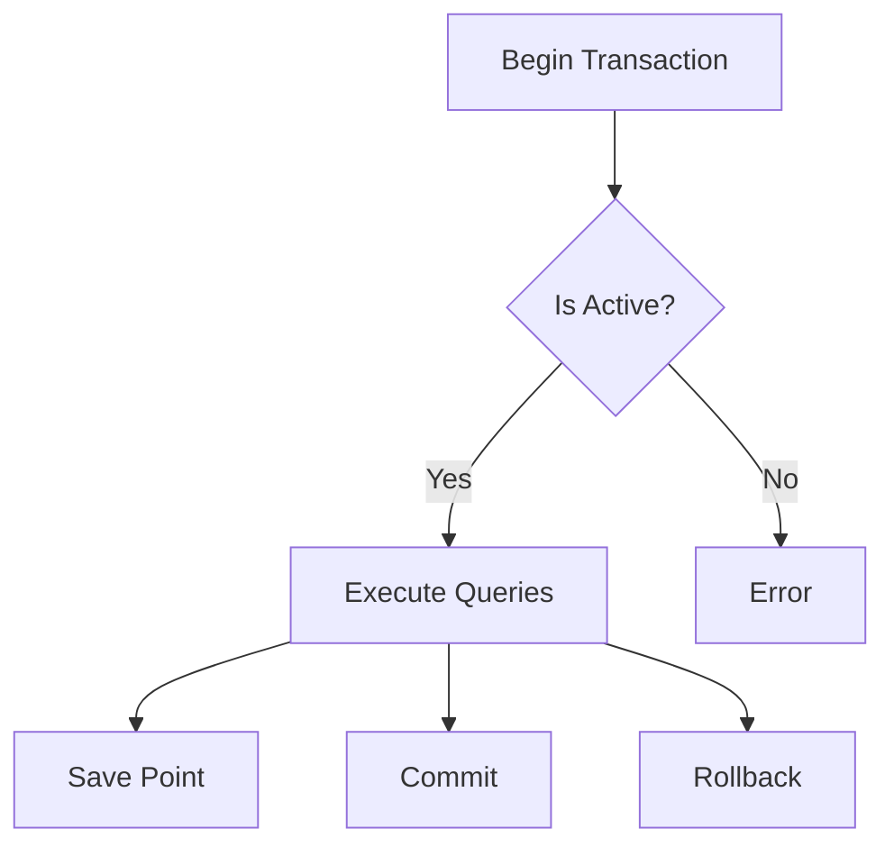
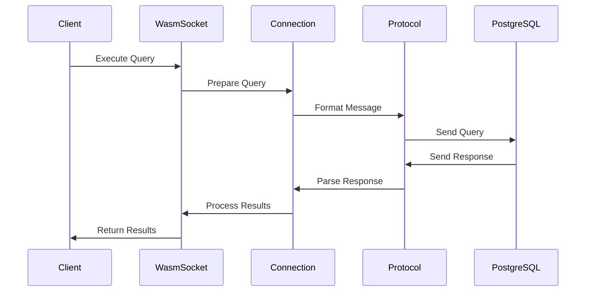

# PostgreSQL Plugin Architecture

## Overview

The PostgreSQL plugin is a WASM-compatible implementation of the PostgreSQL wire protocol using WASI preview2. It provides a bridge between hyper-mcp and PostgreSQL databases while maintaining WASM compatibility and security isolation.

## Core Components

### 1. Network Layer (`net.rs`)

The network layer handles all communication with PostgreSQL servers:

- **Connection Management**
  - `Connection`: Manages buffers for request/response handling
  - `WasmSocket`: WASM-specific socket implementation using WASI preview2
  - `NativeSocket`: Native implementation for testing and development

### 2. Transaction Management (`transaction.rs`)

Provides ACID-compliant transaction handling:

- **Transaction States**
  - Active/Inactive tracking
  - Automatic rollback on drop (RAII)
  - Save point management

- **Isolation Levels**
  - Read Uncommitted
  - Read Committed
  - Repeatable Read
  - Serializable

### 3. Protocol Implementation

Uses `postgres-protocol` crate for wire protocol handling:

- **Frontend Messages**
  - Startup message construction
  - Query message formatting
  - Parameter binding

- **Backend Messages**
  - Response parsing
  - Error handling
  - Result set processing

### 4. Plugin Interface (`lib.rs`)

Exposes the plugin functionality to hyper-mcp:

- **Tool Definitions**
  - `postgres_read_query`
  - `postgres_write_query`
  - `postgres_list_tables`
  - `postgres_describe_table`

## Data Flow

## Error Handling

The plugin implements a comprehensive error handling strategy:

1. **Network Errors**
   - Connection failures
   - Timeout handling
   - Protocol violations

2. **Transaction Errors**
   - State management
   - Deadlock detection
   - Automatic rollback

3. **Query Errors**
   - Syntax errors
   - Constraint violations
   - Resource limits

## Security Considerations

1. **WASM Isolation**
   - Sandboxed execution
   - Limited system access
   - Resource constraints

2. **Network Security**
   - TLS support (planned)
   - Authentication handling
   - Connection pooling

3. **Query Safety**
   - Parameter sanitization
   - Prepared statements (planned)
   - Resource limits

## Testing Strategy

The plugin employs a multi-layered testing approach:

1. **Unit Tests**
   - Component-level testing
   - Mock implementations
   - Error scenarios

2. **Integration Tests**
   - Docker-based testing
   - Full protocol testing
   - Transaction scenarios

3. **WASM Tests**
   - Cross-compilation verification
   - WASI compatibility
   - Performance benchmarks

## Future Enhancements

1. **Performance Optimizations**
   - Connection pooling
   - Statement caching
   - Binary protocol support

2. **Feature Additions**
   - Prepared statements
   - Async query support
   - Extended query protocol

3. **Security Enhancements**
   - TLS support
   - Connection encryption
   - Advanced authentication methods

## Dependencies

Key external dependencies:

- `postgres-protocol`: Wire protocol implementation
- `wasi-preview2`: WASM system interface
- `bytes`: Buffer management
- `extism-pdk`: Plugin development kit

## Build System

The plugin uses a specialized build system for WASM compatibility:

1. **Compilation Targets**
   - wasm32-wasi
   - Native (for testing)

2. **Build Features**
   - Integration tests
   - Debug symbols
   - Optimization levels

3. **Development Tools**
   - Cargo
   - wasm-pack
   - Docker 